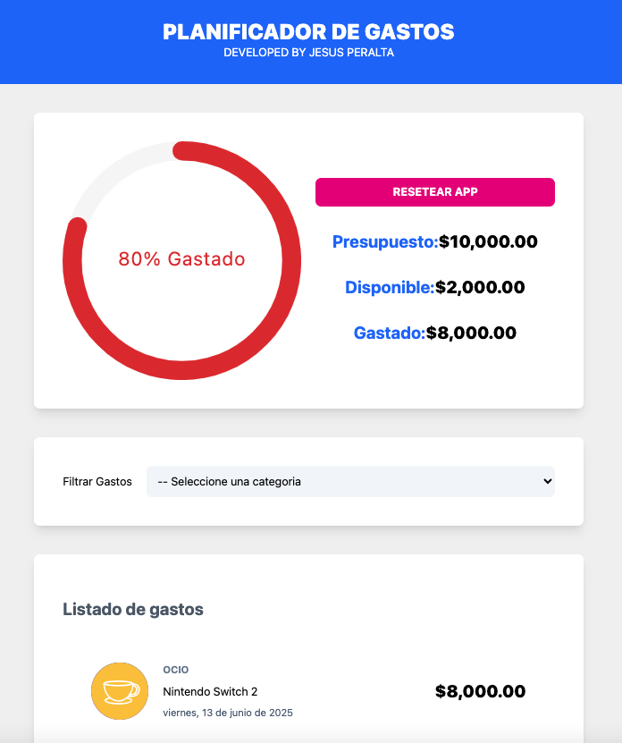

# Expense management app from a budget
An app that lists expenses by category and displays a circle chart comparing them to your allocated monthly budget, changing from blue to red when less than 80% of your budget is left.

It also allows you to edit the characteristics of saved expenses or delete them by dragging them to the right or left.

## 🚀 Tech Stack



## Technologies
React + Typescript + TailwindCSS and different libraries that are listed in the development commits
## Deploy on Netlify
Website hosted on netlify.app server
[presupuesto-contextapi](https://presupuesto-contetextapi.netlify.app/)
## Developer Notes
### Managed by Context API
#### src/reducers/budget-reducer.ts
```
import { v4 as uuidv4 } from 'uuid'
import type { Category, DraftExpense, Expense } from "../types"

export type BudgetActions = 
    { type: 'add-budget' , payload : { budget: number} } |
    { type: 'show-modal' } |
    { type: 'close-modal' } |
    { type: 'add-expense' , payload: { expense: DraftExpense}} |
    { type: 'remove-expense' , payload: { id: Expense['id'] }} |
    { type: 'get-expense-by-id' , payload: { id: Expense['id'] } } |
    { type: 'update-expense' , payload: { expense: Expense } } |
    { type: 'reset-app' } |
    { type: 'add-filter-category' , payload: { id: Category['id'] } }

export type BudgetState = {
    budget: number
    modal: boolean
    expenses: Expense[]
    editingId: Expense['id']
    currentCategory: Category['id']
}

const initialBudget = () : number => {
    const localStorageBudget = localStorage.getItem('budget')
    return localStorageBudget ? +localStorageBudget : 0
}

const localStorageExpenses = () : Expense[]=> {
    const localStorageExpenses = localStorage.getItem('expenses')
    return localStorageExpenses ? JSON.parse( localStorageExpenses ) : []
}

export const initialState : BudgetState = {
    budget : initialBudget(),
    modal: false,
    expenses: localStorageExpenses(),
    editingId: '',
    currentCategory: ''
}

const createExpense = ( draftExpense : DraftExpense ) : Expense => {
    return { 
      ...draftExpense,
      id: uuidv4()  
     }
}

export const budgetReducer = (
    state: BudgetState = initialState,
    action : BudgetActions

) => {

    if( action.type === 'add-budget' ){
        return {
            ...state,
            budget: action.payload.budget
        }
    }

    if( action.type === 'show-modal' ){
        return {
            ...state,
            modal: true
        }
    }

    if( action.type === 'close-modal' ){
        return {
            ...state,
            modal: false,
            editingId: ''
        }
    }

    if( action.type === 'add-expense' ){
        const expense = createExpense( action.payload.expense )
        return {
            ...state,
            expenses: [...state.expenses , expense ],
            modal: false
        }
    }

    if( action.type === 'remove-expense' ){
        return {
            ...state,
            expenses: state.expenses.filter( expense => expense.id !== action.payload.id )            
        }
    }

    if( action.type === 'get-expense-by-id' ){
        return {
            ...state,
            editingId: action.payload.id,
            modal: true
        }
    }

    if( action.type === 'update-expense' ){
        return {
            ...state,
            expenses: state.expenses.map( expense => expense.id === action.payload.expense.id ? action.payload.expense : expense ),
            modal: false,
            editingId: ''
        }
    }
 
    if( action.type === 'reset-app' ){
        return {
            ...state,
            budget : 0,
            expenses: [],
        }
    }

     if( action.type === 'add-filter-category' ){
        return {
            ...state,
            currentCategory: action.payload.id
        }
    }
    return state
}
```
